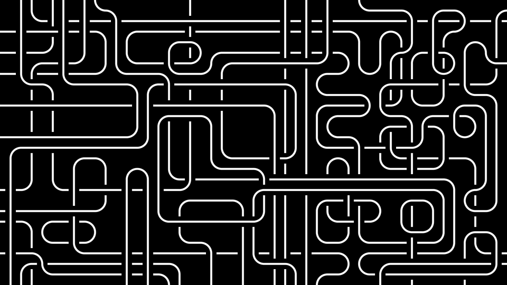

<center>
Image by <a href="https://pixabay.com/users/acatxio-20233758/?utm_source=link-attribution&utm_medium=referral&utm_campaign=image&utm_content=7955446">AcatXIo</a> from <a href="https://pixabay.com//?utm_source=link-attribution&utm_medium=referral&utm_campaign=image&utm_content=7955446">Pixabay</a>
</center>

<br>

Control scructures are the core parts of any programming languages. Every programming languages offers some basic control structure. Conditional statements, looping, exception handling are the most common control structure that most programming languages offers. 

In Python, there are various kinds of control structures like if-else statements, for/while loop, try-except blocks etc. Among those control structures in Python there is one common `else` block in each of them. In this article we will discuss how to use the "else" block in those control structures.

### ELSE with IF statement

If statement is the most fundamental concept in any programming languages. In Python, we can have stand-alone if statement or if statement with else block or multiple conditional if statement. The basic syntax structure like following.

```python
# stand-alone if statement
if condition:
    # execute this block of code

# if statement with else block
if condition:
    # execute this block of code
else:
    # execute this block of code

# multi conditional if statement
if condition:
    # execute this block of code
elif condition:
    # execute this block of code
else:
    # execute this block of code
```

The block of code inside the if statement will be executed if the 'condition' is true. When the 'condition' will be evaluated to false the else block of code will get executed. In the multi-conditional if statement, all the 'condition' will be checked in order and the first block of code will get executed for which the 'condition' evaluates to true. If none of the 'condetion' is true then the else block gets executed.

```python
age = 18
if age >= 18:
    print("You are eligible to vote.")
## OUTPUT
# You are eligible to vote.

age = 16
if age >= 18:
    print("You are eligible to vote.")
else:
    print("You are not eligible to vote yet.")
## OUTPUT
# You are not eligible to vote yet.

marks = 85
if marks >= 90:
    print("Grade: A")
elif marks >= 75:
    print("Grade: B")
elif marks >= 50:
    print("Grade: C")
else:
    print("Grade: F")
## OUTPUT
# Grade: B
```

### ELSE with FOR loop

The `for` loop in Python is used to iterate over a sequence like list, set, string or range. In every iteration it executes the block of code for every element in the sequence. 

```python
for variable in sequence:
    # Code to execute for each item in the sequence
```

Here "variable" is a temporary container to store the current value from the sequence and sequence is an iterable. 

Optionally, a `for` loop in Python has an `else` block. This block of code gets executed when the loop finishes iterating all the elements from the sequence without encountering the break statement.

```python
for num in range(5):
    if num == 6:
        break
else:
    print("Loop completed without a break.")

## OUTPUT
# Loop completed without a break.
```

In the above code block, the loop finishes the iteration without hitting the break statement thus the else block gets executed and prints the output in the console.

### ELSE with WHILE loop

`while` loop in Python is another kind of loop control structure that executes a block of code until a condition becomes false. The basic syntax of while loop with else blcok is as following,

```python
while condition:
    # Loop body
else:
    # Executes if the condition becomes False
```

Like the `for` loop in while loop the else block gets executed when the loop finishes normally, without hitting a break statement. If the execution hits a break statement then the else block won't be executed.

```python
numbers = [1, 2, 3, 4, 5]
target = 6
index = 0

while index < len(numbers):
    if numbers[index] == target:
        print(f"Found {target} at index {index}.")
        break
    index += 1
else:
    print(f"{target} was not found in the list.")

## OUTPUT
# 6 was not found in the list.
```

In the above code, target `6` is missing in the 'numbers' list, thus the loop doesn't encounter the break statement and finishes normally. So it prints the output from the else block.

### ELSE with TRY block

Exception handling is one of the fundamental aspects of any programming language. Python isn't different, it has a excellent mechanism to handle exceptions while executing the code. The purpose of exception handling is to gracefully handle any error at runtime so that it doesn't break the application.

```python
try:
    # Code that may raise an exception
except SomeError:
    # Code to handle the error
else:
    # Executes if no exception occurs
finally:
    # Always executes
```

The `else` and `finally` block is optional here. `finally` bocks gets executed all the time, not matter if exception is raised or not. But the `else` block of code gets executed when there is no exception occured in the code. It is very useful to separate the code that should be run when there is no exception, like validating the results. It helps to keep the try block clean by avoiding unnecessary operations.

```python
numbers = [2, 0, 5]
for num in numbers:
    try:
        result = 10 / num
    except ZeroDivisionError:
        print(f"Cannot divide by zero when processing {num}.")
    else:
        print(f"10 divided by {num} is {result}.")

## OUTPUT
# 10 divided by 2 is 5.0.
# Cannot divide by zero when processing 0.
# 10 divided by 5 is 2.0.
```

### Conclusion

Control structures is a tool that is used by programmers to write great software. It allows a programmer to write small blocks of code that ultimately constructs the entire software. Python offers us an `else` block in various control structures that helps programmers organize the code in more constructive ways. Not only that, it helps group the code in logical structure and makes it more readable and manageable.
