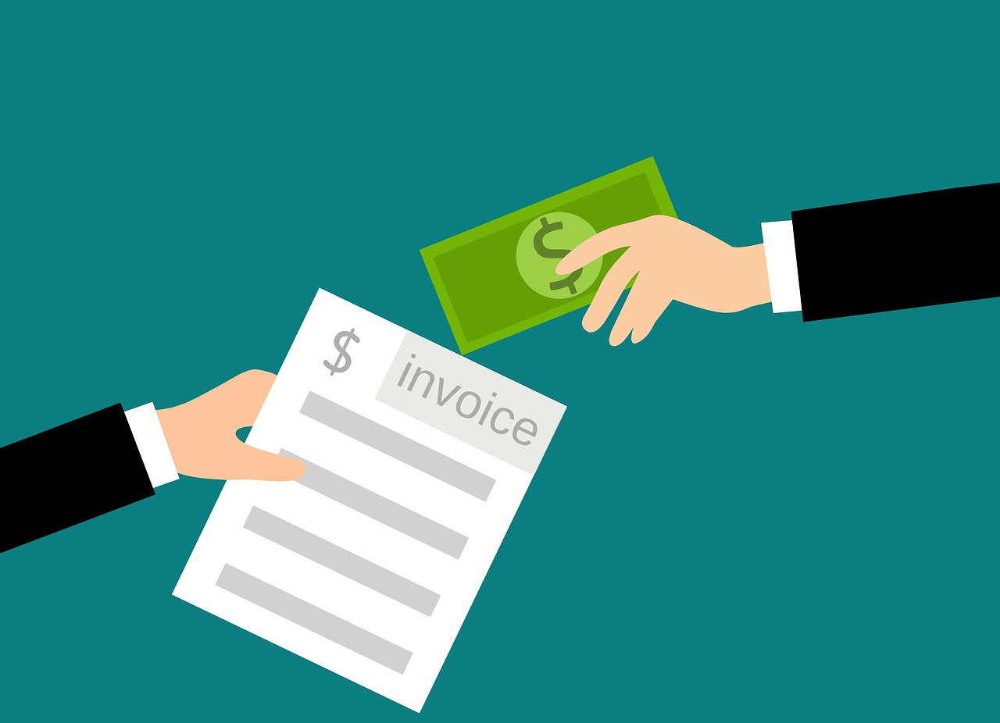

[
Image Source
](https://pixabay.com/illustrations/invoice-cash-payments-concept-3739354/)

Taking advance against an order is a common scenario in business. Usually suppliers take advance from customers to ensure that the order will not be cancelled. Before GST there was no effect of advance on tax. Tax was taken when goods are supplied to customers. However services suppliers needs to pay tax on advance. But under GST tax should be paid on advance for both services and goods. Tax rate will be applicable of the goods and/or services on which the advanced is being received. Based on the place of goods and/or services receiver, CGST + SGST (Intra-state) or IGST (Inter-state) will be applicable.

The supplier will have to issue a **Receive Voucher** for the advance received. However as tax needs to be paid against that advance, the voucher should contains the tax information as well. Details that should be mentioned in an advance receive voucher are as below -

1. Supplier’s name, address and GSTIN
2. Serial number of the receipt voucher, not exceeding 16 characters, containing alphabets or numerals or special characters hyphen (-) or slash (/). It must be unique for a financial year
3. Date of issue
4. If the recipient is registered, the recipient’s name, address and GSTIN or UID
5. Description of the goods or services
6. Amount of advance taken
7. Rate of tax (CGST, SGST, IGST, UGST or Cess)
8. Amount of tax (CGST, SGST, IGST, UGST or Cess)
9. If the supply is interstate, the place of supply, along with the state name and the state code
10. Whether tax is payable on reverse charge
11. Signature or digital signature of the supplier or his authorized representative

If the tax rate is not known at the time of advance received then default 18% tax will be applicable.

In case it is not sure whether it is an intra-state or inter-state transaction the advance receive voucher should be issued as an inter-state transaction.

**Example:** Suppose 'A' gives of RS. 20 lakhs to 'B' as advance for the stationary goods whose  total cost is RS. 40 lakhs. Both 'A' and 'B' are in same state so CGST and SGST will be applied. Suppose total GST of RS. 20 lskhs is RS. 2 lakhs. So 'A' needs to pay RS. 2 lakhs as GST at the time of advance payment. After 2 weeks 'B' prepared all the goods and supplied it to 'A'. He will issue an invoice showing total costs of RS. 40 lakhs and take GST on the remaining amount. At the time of issuing of invoice 'A' will have to pay RS. 22 lakhs including GST to 'B'.

The invoice issued from supplier should mention the advance already received.

One important thing to be noted here that the buyer would not take credit on the GST he/she paid at the time of advance payment. He/she is allowed to take credit only after getting the tax invoice from supplier.

GST on advance payment is a very sensitive topic. Both the supplier and the buyer will have to pay attention when dealing with it. They both have to maintain proper accounting on advance payment/receive.

Click [here](https://www.nahidsaikat.com/tags/accounting/ "Accounting Post") for other accounting related post and [here](https://www.nahidsaikat.com/tags/indian-gst/ "Indian GST") for other GST related post.
