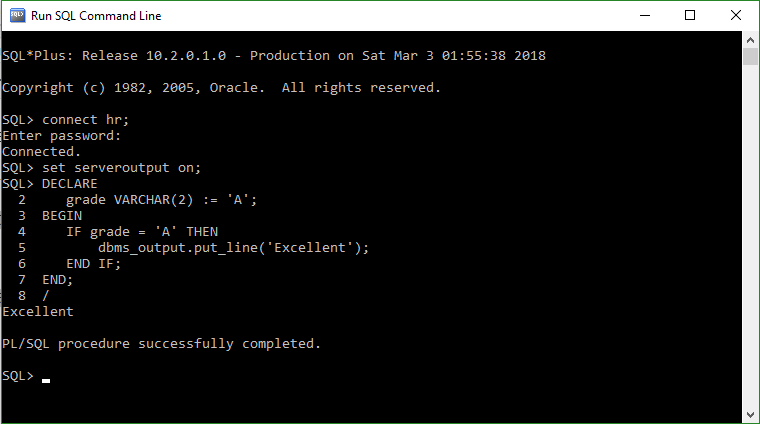
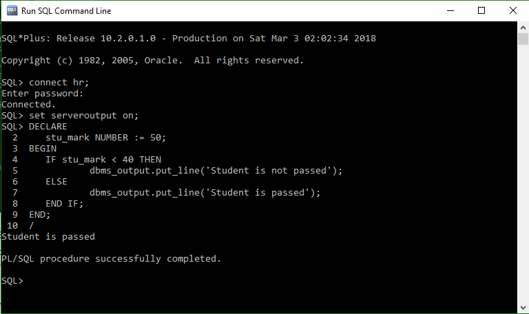
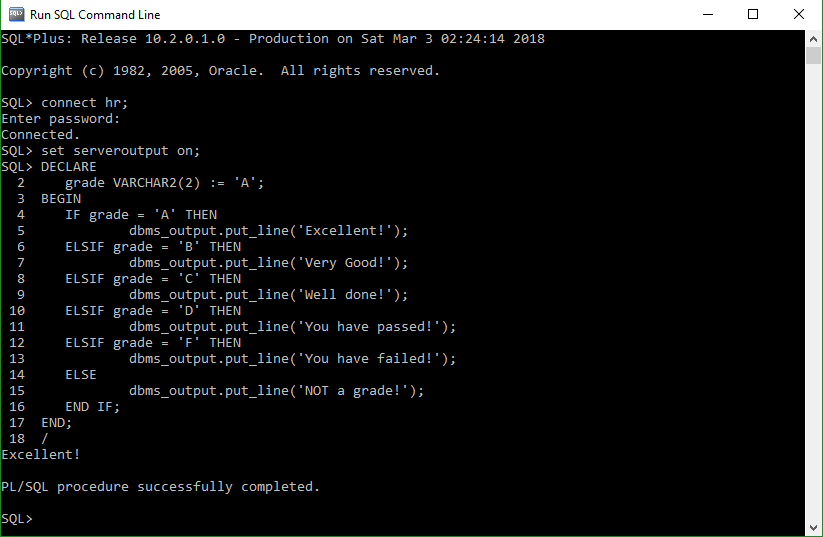

[<center><span style="color:black">Image Source</span></center>](https://pixabay.com/photos/autumn-leaves-branch-bright-3846345/)

Controlling the flow of execution is common in programming. It is very much needed to direct the flow of program based on some conditions. This can be done in any programming language by IF statements. Oracle PL/SQL also has if statement. Oracle supports three kinds of IF statements. Simple IF THEN END IF statement, IF THEN ELSE END IF statement and IF THEN ELSIF ELSE END IF statement.

**IF THEN END IF:** This is the most simple IF statement. The IF keyword is followed by a condition, if the condition is true then the statements between THEN and END IF will get executed. Otherwise the statements will be skipped and execution will continue from the statements immediately after END IF.

General form of IF THEN END IF is following

```ruby
IF conditions THEN
  Statements;
END IF;
```

The following code will show 'Excellent' if the grade is 'A'.

```ruby
DECLARE
  grade VARCHAR2(2) := 'A';
BEGIN
  IF grade = 'A' THEN
    dbms_output.put_line('Excellent');
  END IF;
END;
/
```


**<center>Figure 1: IF THEN END IF Statement</center>**

**IF THEN ELSE END IF:** This kind of IF statement provides bi-directional flow of execution. There are two blocks of statement here. One is between THEN and ELSE keywords and other is between ELSE and END IF keywords. When the condition between the IF and THEN keywords is true statements between THEN and ELSE will get executed. If the condition is false then the statements between ELSE and END IF will get executed.

The general form of this kind of IF statement is

```ruby
IF condition THEN
  Statements;
ELSE
  Statements;
END IF;
```

The following program will show if a student is passed or not.

```ruby
DECLARE
  stu_mark NUMBER := 50;
BEGIN
  IF stu_mark < 40 THEN
    dbms_output.put_line('Student is not passed');
  ELSE
    dbms_output.put_line('Student is passed');
  END IF;
END;
/
```

**<center>Figure 2: IF THEN ELSE END IF Statement</center>**

**IF THEN ELSIF ELSE END IF:** This is the last kind of IF statement. It is little bit complex IF statement. It contains multiple conditions and multiple block of statements. Based on the value of the conditions one block statement will get executed. The program will check conditions from top to bottom. When ever any condition matched it stops checking the conditions and execute the statements in that block and exits the IF statements. If no condition returns a true value then the ELSE statements will be executed.

The general form of this IF statement is

```ruby
IF condition THEN
  Statements;
ELSIF condition THEN
  Statements;
ELSE
  Statements;
END IF;
```

The ELSE statement is optional. If not present and no condition returns true value then no statements will get executed.

The following programs shows message based on the grade of a student.

```ruby
DECLARE
  grade VARCHAR2(2) := 'A';
BEGIN
  IF grade = 'A' THEN
    dbms_output.put_line('Excellent!');
  ELSIF grade = 'B' THEN
    dbms_output.put_line('Very Good!');
  ELSIF grade = 'C' THEN
    dbms_output.put_line('Well done!');
  ELSIF grade = 'D' THEN
    dbms_output.put_line('You have passed!');
  ELSIF grade = 'F' THEN
    dbms_output.put_line('You have failed!');
  ELSE
    dbms_output.put_line('NOT a grade!');
  END IF;
END;
/
```

**<center>Figure 3: IF THEN ELSIF ELSE END IF Statement</center>**

[Visit here](https://www.nahidsaikat.com/tags/oracle-db/ "Oracle DB") for other oracle database related post.
Learn Oracle Database basics from [here](http://www.oracle.com/webfolder/technetwork/tutorials/obe/db/12c/r1/odb_quickstart/odb_quick_start.html "Oracle Database Quick Start").
